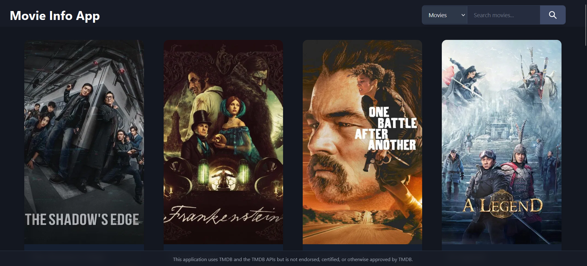
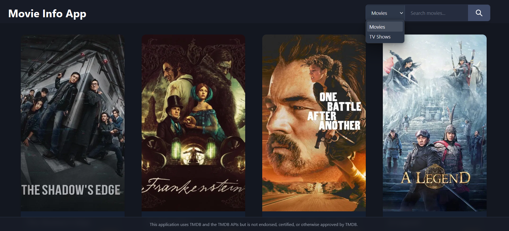
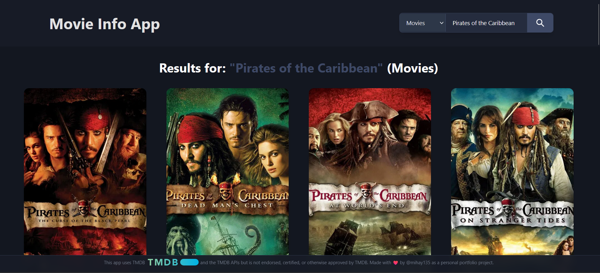
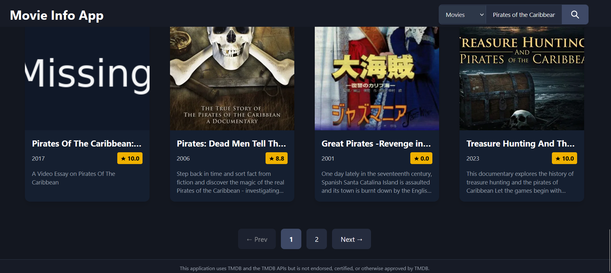
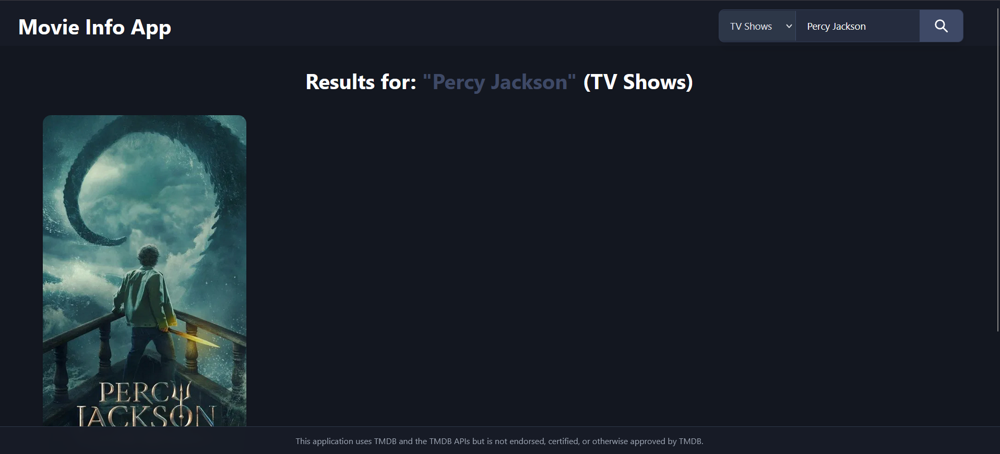
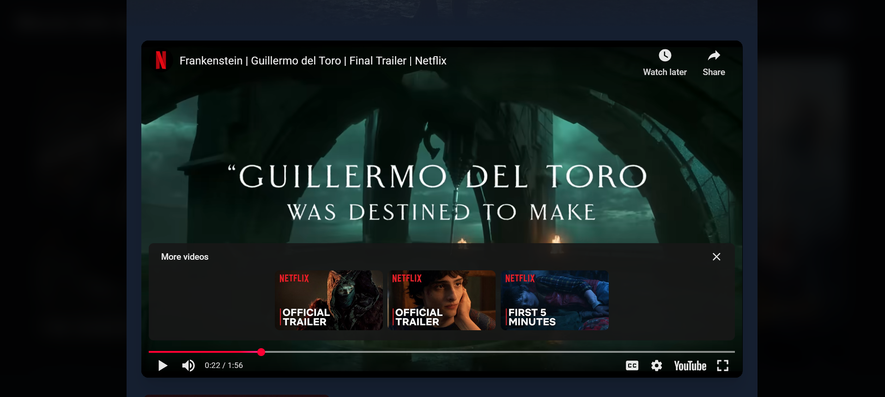

# Movie-Info-App - https://mihay135.github.io/Movie-Info-App/
- Simple Typescript App to fetch some results from TMDB (The Movie DataBase) API.
- On page load it fetches the most popular movies currently on the db and the user can search for a specific movie with the search bar.
- Use the link above to try it!

## Attention! If you are using the above public link to the app please note that:
- This app uses a public TMDB v4 read-only token (as intended by TMDB for client-side demos).  
- Rate limits are enforced by TMDB — abuse from a single IP only affects that abuser.

If you clone the repo you will need YOUR OWN API key / Read-Only token, which you can get for free by registering on the TMBD website and requesting it.

## 📸 Screenshots
| **App View** |
|----------------|
| |
| **Search Category Dropdown Menu** |
|  |
| **Search Movies Result** |
| |
| **Search Results With Multiple Pages** |
|  | 
| **Search Tv Show Result** |
| |
| **Card Click Opens Overlay with Trailer** |
| |
| **Card Click Opens Overlay with info after the Trailer** |
| |

## ✨ Features

- **Automatic Display Of Popular Movies On Load**:
  - When loading the page it will fetch the most popular movies in the db at the moment.
  - These results will be dispalyed on cards that show the movie's poster.
- **Search Functionality**:
  - Users can search the db for movies or tv shows by writing in the search bar and the result is updated automatically.
- **Movie or TV Show Overlay**:
  - Clicking a card opens an overlay with a short description and information, an image and a trailer if it is found.
- **Movies & TV shows** with smart filtering
- **Auto-playing YouTube trailers** in a cinematic modal
- **Detailed info**: rating, runtime/seasons, genres, overview, original language
- **Fully responsive**: looks perfect on mobile, tablet, and desktop
- **Clean, modern UI** with dark mode and smooth animations

## 🛠️ Technologies Used

- **TypeScript**: Core logic for types.
- **React**: For components rendering.
- **HTML/CSS(Tailwindcss)**: Styling with Tailwindcss.
- **Node.js/NPM**: For project setup and dependency management and to run server locally.
- **Vite**: To build the project fast
- **Lucide-React**: For simple icons.
- **Axios**: For simpler fetch requests.
- **TMDB API**: movie & TV data (you will need your own key)

## 📋 Prerequisites

To run Movie App, ensure you have:
- TMDB API Key or Read-only Access token
- Node.js (v16 or higher) and NPM installed.
- A modern web browser (e.g., Chrome, Firefox).
- Git (optional, for cloning the repository).
- A web server to run the app (e.g. use NPM local server)

## Getting Started

### 1. Get a free TMDB API key
Go to [https://www.themoviedb.org](https://www.themoviedb.org), create an account and request an API key (takes 2 minutes).

### 2. Clone and install
```bash
git clone https://github.com/Mihay135/Movie-Info-App.git
cd Movie-Info-App
npm install
```

### 3. Add your own API bearer
Create a .env file in your root or modify the existing one and add:
```env
VITE_TMDB_BEARER_TOKEN=your_actual_bearer_token_here
```

### 4. Run Locally
In your project folder type
```bash
npm run dev
```
Then open on port 5173(usually) at  http://localhost:5173 

## Acknowledgments
- Movie & Tv Shows API Data from <a href="https://www.themoviedb.org/">TMDB</a> (This app uses TMDB and the TMDB APIs but is not endorsed, certified, or otherwise approved by TMDB.)
- Icons from <a href="https://lucide.dev/">Lucide</a>
- <a href="https://react.dev/"> React.js </a>
- Tool to start the project: <a href="https://vite.dev/"> Vite.js</a>

---
Star🌟 this repo if you liked it!
Feel free to open issues or PRs. Contributions are very welcome!


